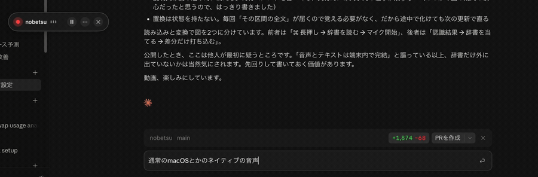

# nobetsu（のべつ）

**日本語で、止まらずに、喋り続けられる音声入力。**

日本語で音声入力をすると、だいたいこうなります。

- 喋っている途中で**固まる**。変換が追いつかなくなる
- AI エージェントのマイクは**数分で切れる**。長文を一息で入れられない
- **キーを押している間しか喋れない。**離した瞬間に終わり、文字はまとめて貼りつく

nobetsu は **⌘ を 1 秒押して、離します。それだけです。**
あとは指をどこにも置かずに、好きなだけ喋り続けられます。**押しっぱなしにする必要はありません。**
止めるときに、もう一度 ⌘ を軽く叩くか ESC を押します。

話した端から、そのとき使っているアプリに文字が入ります。時間制限はありません。
日本語入力（IME）を経由しません。すべて端末内で完結し、音声も文字も外部に送信しません。



[全編を見る（26秒）](docs/nobetsu-demo.mp4)

> **のべつ幕なし** — 芝居で幕を下ろさずに演じ続けること。転じて、絶え間なく続くこと。

*English speakers: see [English](#english) below for what this is and why it exists.*

---

## なぜ日本語だけ、こうなるのか

日本語の入力は IME（日本語入力）を通ります。macOS 標準の音声入力は、認識した「よみ」を
その IME に流し込みます。IME は文脈から漢字を選ぼうとして未確定の文字を書き換え続けるので、
**喋り続けると追いつかなくなって止まります。**

**英語には変換工程がありません。**だからこの問題は英語圏では起きず、
既存の音声入力ツールのほとんどが英語圏の開発者によるものである以上、誰もここを解いていません。

nobetsu は変換工程を丸ごと迂回します。macOS 26 の `DictationTranscriber` は
漢字かな交じりの**変換済みテキスト**を返すので、それを直接打ち込みます。ぶつかる相手がいません。

### 実際に入る文章

このツールで喋って入力したものです。手直ししていません。句読点も自動で入ります。

```
なんか出ましたね。そして話せるようになりましたね。おおすげすげすげえ下にも出て
上にも出るんだ。認識もとても良いね。今 AirPods をつけていてだから多分さっきよりも
マイク入力の感度は高くて、耳元に対してマイク入力されてる感じにはなるんだと思うよね。
見てる感じでも全然何かタイプミスがなさそうな感じでいいなぁ。もうちょっと早く
しゃべってみようかな。どれぐらいで行けるだろうか。結構感動してるね。
```

誤りは 500〜670 字あたり 5〜7 箇所（およそ 1.2〜1.5%）でした。[計測結果](#計測結果)を参照してください。
残る誤変換は[辞書](#辞書で誤変換を直す)で潰していけます。

## 動作環境

| | |
|---|---|
| OS | **macOS 26 (Tahoe) 以降** |
| CPU | **Apple Silicon**（M1 以降）。Intel Mac では動きません |
| Xcode | **不要**。コマンドラインツール同梱の `swiftc` だけでビルドできます |
| コード署名 | **自己署名の証明書が要ります**（[下記](#ソースからビルドする前に1回だけ)）。Apple Developer Program は不要です |
| 依存ライブラリ | なし。すべて OS 標準のフレームワーク |
| 動作確認 | MacBook Air (M4, 2024) / macOS 26.5.2 |

M3 や M4 でなくても構いません。初回だけ日本語の認識モデルを OS がダウンロードします。
以後はオフラインで動きます。

## 入れる

### ソースからビルドする前に（1回だけ）

**自己署名の証明書を1つ作ってください。これが無いと、ビルドは通っても使えません。**

macOS の許可（入力監視・アクセシビリティ）は**署名の同一性**に紐づいて記録されます。
Apple Developer Program に入っていない Mac でそのままビルドするとアドホック署名になり、
同一性が無いため **入力監視は許可のダイアログすら出ずに拒否されます。**
⌘ を長押ししても、うんともすんとも言わないアプリができあがります。

証明書を1枚作れば、これはまるごと消えます。5分で終わる、最初の1回だけの作業です。

1. 「キーチェーンアクセス」を開く
2. メニューの「キーチェーンアクセス」→「証明書アシスタント」→「自分に証明書を作成」
3. 名前 `nobetsu` / 固有名のタイプ「**自己署名ルート**」/ 証明書のタイプ「**コード署名**」
4. できた証明書をダブルクリック →「信頼」→「コード署名」を「**常に信頼**」にする
5. 初回のビルドでキーチェーンのパスワードを聞かれたら「**常に許可**」を選ぶ

できているかは、ビルドせずに確かめられます。

```bash
./build.sh --check
```

`✅ 証明書「nobetsu」で署名できます` と出れば大丈夫です。

証明書が無いとき、`./build.sh` は**設置せずに止まります。**
動かないアプリを `/Applications` に残しても、動かない理由にたどり着けないためです。
コンパイルが通ることだけ確かめたい場合は、それと分かる形で先へ進められます。

```bash
NOBETSU_ALLOW_ADHOC=1 ./build.sh
```

> **配布された .app を使う場合、この証明書は要りません。**
> Developer ID で署名・公証されたものには、既に安定した署名の同一性があるためです。
> ただし**入力監視とアクセシビリティの許可は、どちらにせよ必要です。**
> なお、いまは配布版がありません。署名と公証には Apple Developer Program（年額）が要るためで、
> 当面はソースからビルドしてもらう方針です。

### 入れる

```bash
git clone https://github.com/pochang6/nobetsu.git
cd nobetsu
./build.sh
open /Applications/nobetsu.app
```

`./build.sh` がビルドから `/Applications` への設置までを行います。
`/Applications` に置くのは、システム設定の許可一覧がそこからしかアプリを選べないためです。

メニューバーに波形のアイコンが出ます。ウィンドウも Dock アイコンも出ません。

### 既に入れてあるものを更新する

一度ビルドした Mac では、更新のたびに証明書や許可を作り直す必要はありません。
リポジトリで次の3行を実行してください。

```bash
git pull
./build.sh
open /Applications/nobetsu.app
```

`./build.sh` は動いている旧版を終了して、新しい版へ入れ替えます。
署名が同じなら、入力監視・アクセシビリティ・マイクの許可もそのまま引き継がれます。
メニューバーの一番下に表示される版が、GitHub の最新 Release と同じなら更新完了です。

### 必要な許可

**入力監視とアクセシビリティは、別々の許可です。**片方だけでは動きません。
初回に順番に求められるので、macOS 標準のダイアログでそのまま許可してください。

| 許可 | 何の許可か | 聞かれる場面 |
|---|---|---|
| **入力監視** | **キーを読む**許可。⌘ の長押しを待ち受ける | 起動した直後 |
| **アクセシビリティ** | **他のアプリへ文字を入れる**許可 | 入力監視のあと |
| **マイク・音声認識** | 音声を文字にする | 初めて喋るとき |

順番は必ず 入力監視 → アクセシビリティ です。逆にすると入力監視の要求そのものが通らなくなる、
macOS 側の不具合があるためです。**入力監視が下りない限り、アクセシビリティの要求へは進みません。**

**許可が無い間は、⌘ を長押ししても何も起きません。**そこで許可を聞かれることもありません。
足りていないときはメニューバーのアイコンが**警告の三角**になり、
メニューを開くと「何が足りないのか」「それは何の許可か」「どの設定画面を開けばよいか」が出ます。
ダイアログを閉じてしまった場合も、そこからやり直せます。

許可は「そのパスにあるアプリ」に付きます。設定の一覧で選ぶのは
`/Applications/nobetsu.app` です（リポジトリの中でビルドしたものとは別扱いになります）。

## 使う

| 操作 | 動き |
|---|---|
| **⌘ を長押し**（既定1.0秒） | 認識が始まる。指を離しても続く |
| **もう一度 ⌘ を軽く叩く** | 停止 |
| **ESC** | 停止 |
| 左上の目印をクリック | 停止 |

開始と終了は音で知らせます。画面を見ていなくても状態が分かります。

⌘ は macOS のあらゆるショートカットの起点ですが、
**⌘ を押している間に他のキーやクリック、ホイールが来たら、それはショートカットだと見なして発火しません。**
⌘Tab や ⌘S でためらっても、⌘＋ホイールで拡大縮小しても暴発しません。
長押し時間は0.5〜2.0秒の範囲で0.1秒ずつ調整できます。
開始に使うキーも、左右・左だけ・右だけから選べます。

### 設定

メニューバーのアイコンから開きます。

| 項目 | 既定 | 何が起きるか |
|---|---|---|
| ログイン時に起動 | **入** | Mac を起動したら自動で常駐します。切ると毎回自分で開くことになります |
| 開始と終了を音で知らせる | **入** | 聞ける状態になった瞬間に開始音、止めた瞬間に終了音。画面を見ていなくても状態が分かります。会議中など、音を出したくないときは切ってください |
| 左上に認識中の目印を出す | **入** | 認識中に小さな目印が浮きます。声の大きさも出るので、マイクが拾えているかが分かります。ドラッグで好きな場所へ動かせます |
| 認識中の文字を画面に流す | 切 | 認識中の文字を画面上に大きく流します。**入力先の文章と重なって読みにくくなる**ので既定は切です |
| 開始までの長押し | **1.0秒** | 0.5〜2.0秒の範囲を0.1秒刻みで調整します。コピーや貼り付けの次のキーを押すまで迷っても発火しにくいよう、以前の0.5秒から既定を延ばしました |
| 開始に使う ⌘ | **左右どちらでも** | 「左だけ」「右だけ」に絞れます。ここで選ぶのは開始キーだけで、停止は左右どちらの⌘でもできます |
| 入力先から離れたら止める | **入** | 別のアプリや別の画面へ移った時点で止まります（[下記](#入力先から離れたら止める)）。切ると、どこへ移っても喋り続けられます |
| 遠距離マイク補正 | **入** | マイクから離れて話す前提で認識します。マイクを口元に近づけて使う場合は切ってください。認識中は変更できません |
| 辞書を編集する | — | 個人辞書をテキストエディタで開きます。無ければ雛形を作ります |

認識中は、目印の「…」からもよく使うものだけ触れます。

| 項目 | 何が起きるか |
|---|---|
| 開始と終了を音で知らせる | 上と同じ |
| 認識中の文字を画面に流す | 上と同じ |
| 入力先から離れたら止める | 上と同じ |
| 開始までの長押し | 上と同じ。スライダーで調整できます |
| 開始に使う ⌘ | 上と同じ。左右・左だけ・右だけから選べます |
| 辞書を編集する | 上と同じ |
| この目印の位置を初期状態に戻す | ドラッグで動かした位置を忘れ、既定の場所へ戻します |
| 音声入力を止める（ESC） | 認識を終えて目印を閉じます。ESC でも同じです |

目印そのものには、一時停止（**Ⅱ**）と終了（**×**）のボタンもあります。
一時停止は目印を残したまま認識だけ止めるので、そのまま再開できます。

### 入力先から離れたら止める

既定では、**喋っている途中で別のアプリや別の画面へ移ると、そこで止まります。**

始めたことを忘れたまま席を移ると、独り言がそのまま同僚宛の入力欄へ流れ込みます。
起きたときの代償が大きいので、安全な側に倒しています。

同じアプリの中で別の入力欄へ移っただけなら止まりません。設定を開いている間も止まりません。
**自分で止めたときとは違う音が鳴ります。**押していないのに終わるので、
同じ音では何が起きたのか分からないためです。止まった理由はメニューにも残ります。

一日中つけっぱなしにして、あちこちで喋りたい場合は切ってください。

## 辞書で誤変換を直す

音声認識は「Clone」を「苦労」と書きます。**話し言葉としては正しい**ので、認識器の側では直りません。
打ち込む直前に、こちらで書き換えます。

### 書き方

1行に1組。左が「認識器が書いてしまう文字」、右が「本当に打ちたい文字」です。

```
苦労してくる => Cloneしてくる
クロードコード => Claude Code
プライマリー機 => プライマリーキー
```

- `#` から行末はコメント。空行は無視されます
- 区切りは `=>` のほか `→`（矢印）とタブも使えます
- 左右とも、記号や英数字を含むふつうの文字列でそのまま書けます。引用符もエスケープも要りません

> **なぜ JSON やキー・バリュー形式ではないのか。**
> 左右どちらにも `:` や `"` や空白がそのまま現れるからです。JSON にすると引用符と
> エスケープが必要になり、手で足すときの負担が跳ね上がります。`:` を区切りにしなかったのも
> 同じ理由で、`10:30 => 10時30分` のような規則が書けなくなります。
> **思いついたその場で1行足せること**を最優先にしています。

### 2枚の辞書

| | 置き場所 | 反映のしかた |
|---|---|---|
| 同梱辞書 | リポジトリの `dictionary.sample.txt` | `./build.sh` でアプリに焼き込まれます |
| 個人辞書 | `~/Library/Application Support/nobetsu/dictionary.txt` | **保存するだけ** |

同じ言葉が両方にあれば**個人辞書が勝ちます**。
読み込むのは**喋りはじめる瞬間**なので、保存したら次のひと言から効きます。

**普段はこちらだけ触れば足ります。**個人辞書はメニューの「辞書を編集する」から開けます
（無ければ雛形を作ります）。ビルドし直す必要はありません。

同梱辞書のほうは、公開してよい共通の見本です。自分用の辞書は上の個人辞書へ書いてください。
リポジトリ直下の `dictionary.txt` は `.gitignore` されており、そこへのシンボリックリンクを
個人辞書に置く運用もできますが、アプリ内には焼き込みません。古い規則を削除したとき、
同梱した複製から復活するのを防ぐためです。

### 2つだけ、守ってください

**短い言葉を左に置かない。** 「苦労」を `Clone` にすると、本当に苦労した話が書けなくなります。
「苦労してくる」のように少し長めに取ってください。
長い規則から先に当たるので、短いものと両方書いても長い方が勝ちます。

**左が右の一部になる規則は書けません。**

```
品予約履歴 => 備品予約履歴     ← だめ
```

正しく「備品予約履歴」と認識されたときにも中の「品予約履歴」が引っかかり、
「備備品予約履歴」になります。直すほど壊れるので、読み込み時に捨てています。

## 仕組み

```
マイク
  ↓  AVAudioEngine
SpeechAnalyzer + DictationTranscriber (ja-JP, 端末内)
  ↓  未確定テキスト / 確定テキスト
辞書で置換
  ↓
CGEvent の Unicode 直接入力（IME を経由しない）
  ↓
そのとき使っているアプリ
```

肝は2つです。

**IME を通さない。** `DictationTranscriber` は変換済みのテキストを返すので、
`CGEvent` の Unicode 直接入力で打てば変換工程を丸ごと迂回できます。**これがこのアプリの存在理由です。**

**確定を待たない。** 未確定のテキストを先に打ち込み、認識が書き換わったら、
前回打ち込んだ文字列との共通接頭辞を求めて、食い違った末尾だけを消して打ち直します。
確定を待つ設計にすると、下の計測どおり 20 秒以上も文字が出てきません。

### 辞書はいつ、どう当たっているのか

**AI は関わりません。**アプリがファイルを読んで文字列を置き換えているだけで、
辞書がどこかへ送られることも、ネットワークに出ることもありません。

読むのは**喋りはじめる瞬間の1回だけ**です。ファイルの更新時刻を見て、変わっていなければ読み直しません。
このとき `#` 以降は捨てられ、**文字列の組だけが残ります**（何行コメントを書いても実行時の負担はゼロです）。
同梱辞書に個人辞書を重ね、自滅する規則を捨て、左辺の長い順に並べ替えます。

喋っている間、認識器は「**その区間の全文**」を毎秒4回ほど送ってきます。届くたびに全部の規則を当てます。

```
DictationTranscriber
  ↓  「苦労してくるね」（区間の全文）
辞書を当てる ── 規則の数だけ置換するだけ。前回何をしたかは覚えていない
  ↓  「Cloneしてくるね」
打ち込み ── 前回打った文字列と比べて、変わった末尾だけ打ち直す
  ↓
使っているアプリ
```

状態を持たないのが大事なところです。認識が「くろー」→「クローン」→「Cloneしてくる」と
変わる途中で一瞬おかしな形になっても、**次の更新で正しく打ち直されます。**

### 計測結果

`spike/` に、3つのエンジン構成を実測して比較するアプリを残してあります。
MacBook Air M4 / macOS 26.5.2 / 日本語の自然な発話 80〜105 秒での結果です。

| | Dictation +<br>frequentFinalization | Dictation | SpeechTranscriber |
|---|---|---|---|
| 初回表示まで | 1.63 秒 | 1.33 秒 | **11.79 秒** |
| 途中経過の遅延 平均/最大 | 0.16 / 0.38 秒 | 0.16 / 0.38 秒 | 0.08 / 0.18 秒 |
| 確定の遅延 平均/最大 | 0.42 / 0.86 秒 | 0.32 / 0.52 秒 | **3.78 / 8.34 秒** |
| 誤り | 500字中 7 箇所 | 668字中 5 箇所 | 531字中 5 箇所 |

**SpeechTranscriber は喋りながら見る用途には使えません。** 初回表示に 11.79 秒、
確定は最大 8.34 秒遅れます。精度自体は3構成とも大差ありませんでした。

## 開発するとき

証明書は[上](#ソースからビルドする前に1回だけ)で作ったものをそのまま使います。
`build.sh` が `nobetsu` という名前の証明書を自動で探し、**実際に署名できるか**を試してから進みます。
`security find-identity` の一覧には出ないのに署名は通る、という食い違いが実際にあったためです。

署名が固定されていれば、**ビルドし直しても許可はやり直しになりません。**
ここが崩れると、コードを直すたびに許可を付け直すことになり、それだけで開発が続かなくなります。

### テスト

```bash
./test.sh
```

副作用を持たない部分——辞書の置換、打ち込みの差分計算、許可の案内、
開始キーの設定、ログの圧縮——を確かめます。
アプリを起動せずに走ります（数秒）。

入力と出力だけで完結していて、壊れると利用者の文章・起動手順・過去のログへ
影響するところを機械で確かめています。
マイク・イベントタップ・他アプリへの打ち込みは実機でしか確かめられないので、
そちらは実際に動かして見ています。

不具合を調べるときは、推測の前にログを読んでください。

```bash
tail -30 ~/Library/Logs/nobetsu.log
```

**喋った内容そのものは書き出しません。** 残るのは時刻・アプリ名・文字数だけです。
1MB を超えたら圧縮して退避し、いまのファイルを含めて5世代（`nobetsu.log.1.gz` 〜 `.4.gz`）残します。
全部合わせても 1.5MB を超えません。古いものは `gunzip -c` で読めます。

設計上の判断と、その理由は [CLAUDE.md](CLAUDE.md) にまとめてあります。

## これから

- [ ] 誤変換の抑制（`SFSpeechLanguageModel` によるカスタム言語モデル）
- [ ] App Intents 対応（Shortcuts.app から呼べるようにする）

分かっていて直していないことも含めて、[TODO.md](TODO.md) に書いてあります。

## 免責

**趣味で作って、そのまま置いてあるものです。**
MIT ライセンスのとおり**無保証**で、使ったことで何かが起きても責任は負えません。

- 他のアプリへキー入力を送るツールです。**思わぬところへ文字が入る可能性があります**
- 不具合の報告は歓迎しますが、**対応をお約束はできません**
- Pull Request も歓迎しますが、方針に合わないものはお断りすることがあります
- 大事な場面で使う前に、ご自身の環境で十分に試してください

---

## ライセンス

MIT — [LICENSE](LICENSE)

音声認識には Apple の `SpeechAnalyzer` / `DictationTranscriber` を使っています。
モデル本体は OS が管理する Apple の資産であり、このリポジトリには含まれません。

## 作った人

**ぽちょ研究所 / Pochang Lab** — [@pochang6](https://github.com/pochang6)

---

## English

**nobetsu** — dictation for Japanese speakers who want to keep talking, and talking.

**Press ⌘ for one second and let go.** That is it — you can then keep talking for as
long as you like, hands free. **It is not push-to-talk.** Tap ⌘ again, or press ESC, to stop.

Text lands directly in whatever app you are using, as you speak. No time limit.
Everything runs on your Mac; no audio or text leaves the device.

The hold time is adjustable from 0.5 to 2.0 seconds in 0.1-second steps. You can also
choose both Command keys, only the left one, or only the right one for starting dictation.

*Nobetsu maku nashi* (のべつ幕なし) is a Japanese phrase meaning "without ever lowering
the curtain" — going on and on without pause.

### Why this exists

Japanese input goes through an IME. As you speak, macOS dictation feeds the *readings*
into that IME, which keeps rewriting unconfirmed text while trying to pick the right
characters from context. With continuous speech, it can't keep up, and dictation stalls.

English has no conversion step, so this failure mode does not exist for English speakers.
That is why none of the existing open-source dictation tools address it — and why
this one is written in Japanese, for Japanese.

nobetsu sidesteps the problem entirely. macOS 26's `DictationTranscriber` returns
already-converted Japanese text, so the app types it directly with `CGEvent` Unicode
input, bypassing the IME. There is nothing left to collide with.

It also types *before* the recognizer finalizes, diffing against what it typed last
time and rewriting only the tail that changed. Waiting for finalization means waiting
more than 20 seconds for text to appear — measured, not guessed.

### Requirements

macOS 26 (Tahoe) or later, Apple Silicon. No Xcode needed.

**Before you build, create a self-signed code-signing certificate named `nobetsu`**
(Keychain Access → Certificate Assistant → Create a Certificate; Self Signed Root,
Code Signing; then set its trust for Code Signing to *Always Trust*). macOS ties
Input Monitoring and Accessibility to a **stable code signature**. An ad-hoc signature
has none, so Input Monitoring is denied outright — without ever showing a prompt.
`./build.sh --check` tells you whether signing works, and `./build.sh` refuses to
install an ad-hoc build rather than leaving a dead app in `/Applications`.

```bash
git clone https://github.com/pochang6/nobetsu.git
cd nobetsu
./build.sh --check   # certificate in place?
./build.sh
open /Applications/nobetsu.app
```

macOS will ask for Input Monitoring first, then Accessibility. They are separate
permissions and both are required — Input Monitoring to read the ⌘ key, Accessibility
to type into other apps. Until they are granted, holding ⌘ does nothing at all.

The UI is Japanese only. The recognizer is Japanese only. This is deliberate —
the problem it solves does not exist outside Japanese.

### License

MIT — see [LICENSE](LICENSE). Copyright (c) 2026 pochang6.

Speech recognition uses Apple's `SpeechAnalyzer` / `DictationTranscriber`.
The models belong to the OS and are not part of this repository.

### Disclaimer

**This is a hobby project, published as is.** As stated in the MIT license, it comes
with **no warranty of any kind**, and I cannot take responsibility for what happens
when you use it.

- It sends synthetic key events to other applications. **Text may land somewhere you did not intend.**
- Bug reports are welcome, but **a response is not guaranteed**.
- Pull requests are welcome, but may be declined if they do not fit the direction of the project.
- Try it in your own environment before relying on it for anything that matters.
